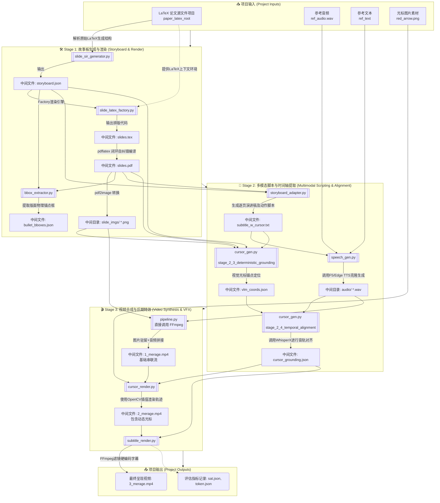

# P2VIR 项目总体流程架构图

根据 `src/pipeline.py` 中的代码逻辑，P2VIR 管道系统分为三大主要阶段（Stage 1 ~ Stage 3）。
以下 Mermaid 流程图精准地反映了项目的输入、所涉及的关键脚本、各类中间文件及最终的输出结果。

我已经根据当前项目中的核心编排脚本 `src/pipeline.py` 梳理出了整个项目的处理逻辑，并生成了一张清晰直观的  **项目总体架构流程图** （通过 Mermaid 图表引擎渲染出图，点击上方生成的文件即可直接查看）。

这份流程图 **完全遵照了代码的实际调度关系** ，我为你加上了详细的逻辑拆解注释，帮助你更好地理解每个模块在做什么，以及中间生成了哪些关键文件：

### 📥 1. 项目输入模块 (Inputs)

系统需要这 4 个底层基础输入才能运转：

* **`paper_latex_root`** : 用户指定的 LaTeX 论文源文件目录
* **`ref_audio.wav`** : 供 TTS 克隆说话人音色的参考音频
* **`ref_text`** : 参考音频对应的文本
* **`red_arrow.png`** : (位于 `src/cursor_image/`) 用于后期视频中渲染引导视线的物理光标素材。

---

### 🛠️ 2. Stage 1: 故事板生成与幻灯片渲染 (Storyboard & Render)

*目标：通过大模型(LLM)与基于规则的工厂模式(Factory)，将干瘪的论文提取、渲染成视觉呈现。*

* **脚本 `slide_sir_generator.py`** :
* **输入** : LaTeX 源文件
* **中间文件** : 解析生成结构化数据 `storyboard.json` (SIR)
* **脚本 `slide_latex_factory.py`** :
* **输入** : `storyboard.json` + LaTeX 上下文环境
* **中间文件** : 它首先渲染成排版代码 `slides.tex`，再调用 `pdflatex` 闭环编译生成 `slides.pdf`。并调用 `pdf2image` 截取生成幻灯片图像序列 `slide_imgs/` (`.png`)。
* **脚本 `bbox_extractor.py`** :
* **输入** : `slides.pdf` + `storyboard.json`
* **中间文件** : 提取版面坐标数据 `bullet_bboxes.json`（为 Stage 2 视觉定位做准备）

---

### 🧠 3. Stage 2: 多模态脚本与时间轴提取 (Multimodal & Alignment)

*目标：让视觉幻灯片具备与其匹配的演讲内容、语音，以及它们之间确定的空间与时间映射坐标。*

* **脚本 `storyboard_adapter.py`** :
* **输入** : `storyboard.json` + `slides.pdf`
* **中间文件** : 生成逐页对应的带光标动作脚本 `subtitle_w_cursor.txt`
* **脚本 `speech_gen.py`** :
* **输入** : `subtitle_w_cursor.txt` + `ref_audio.wav` + `ref_text`
* **中间文件** : 调用 TTS (Edge/F5) 输出音频文件组 `audio/*.wav`
* **脚本 `cursor_gen.py` (阶段 2.3 - 空间定位)** :
* **输入** : `subtitle_w_cursor.txt` + `slide_imgs/` + `slides.pdf`
* **中间文件** : 生成视觉光标锚点映射 `vlm_coords.json`
* **脚本 `cursor_gen.py` (阶段 2.4 - 时间对齐)** :
* **输入** : `vlm_coords.json` + `audio/*.wav`
* **中间文件** : 调用 WhisperX 输出空间+时间完全绑定的 `cursor_grounding.json`

---

### 🎬 4. Stage 3: 视频合成与后期特效 (Video Synthesis & VFX)

*目标：将之前阶段产生的所有图片、声音、坐标信息，利用 FFmpeg 和 OpenCV 合成最终视频。*

* **`pipeline.py` 主程序直接调用 `FFmpeg`** :
* **输入** : `slide_imgs/` + `audio/*.wav`
* **中间文件** : `1_merage.mp4` (最基础的翻页串联视频，此时还没有光标和字幕)
* **脚本 `cursor_render.py`** :
* **输入** : `1_merage.mp4` + `cursor_grounding.json` + `red_arrow.png`
* **中间文件** : 利用 OpenCV 差值运算生成平滑拖动的光标动作视频 `2_merage.mp4`
* **脚本 `subtitle_render.py`** :
* **输入** : `2_merage.mp4` + `cursor_grounding.json`
* **项目最终输出** : 使用滤镜将字幕硬编码烧录，生成最终视频 **`3_merage.mp4`**

### 📤 5. 项目额外输出 (Outputs)

伴随 `3_merage.mp4` 的输出，系统最后还会对这三个阶段的执行耗时以及 Token 消耗进行统计，最终生成两个性能及成本评估记录文件（在论文的 Evaluation 章节可以用到）：

* `evaluation/sat.json`
* `evaluation/token.json`

流程图我已经在右侧的独立展示区为你生成，这样更符合科研和开发中的系统化复盘视角，如果需要在此基础上调整或探讨其他技术点，我们可以随时沟通！

